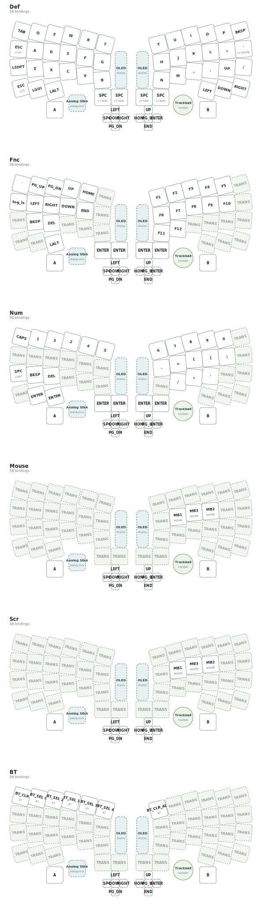

# SparAkashaAnanta - スパラカシャ・アナンタ

```
                                                ########                                                                                                
                                              ##        ##                                                                                              
                                            ##    ####  ####                                                                                            
                            ######          ##    ####    ##        ######                                                                              
                            ##    ####      ##  ##    ##  ##    ######    ##                                                                            
                          ##  ####    ##  ##  ##      ####      ##    ####  ##                                                                          
                          ##  ######    ####  ##        ##  ####    ##  ##  ##                                                                          
                          ##  ##  ######  ##            ##  ##  ######  ##  ##                                                                          
                          ##  ##      ####  ##            ##  ##        ##  ##                                                                          
                ############  ##        ##    ##        ####  ##        ##  ############                                                                
              ##          ####          ####  ##      ##  ##  ##      ##  ####          ##                                                              
              ##  ####        ####      ##  ##  ##    ##  ##  ##      ####        ####  ##                                                              
              ##  ##  ########    ####  ##  ##  ##        ##  ##  ##      ########  ##  ##                                                              
                ##  ##        ####    ####  ####  ####  ####  ####    ####        ##  ##                                                                
                ##  ##        ##  ####  ##  ####  ####  ####  ##  ####  ##        ##  ##                                                                
                  ##  ##      ##    ####  ##  ##  ##    ##  ##  ####            ##  ##                                                                  
                  ##  ############  ##  ####  ####    ####  ######    ##############                                                                    
                  ####            ##  ######    ####  ##    ####    ##            ####                                                                  
                ####    ########    ##    ####  ####  ##  ####    ##    ########    ####                                                                
              ####  ########    ########    ####        ####    ########    ##  ####  ##                                                                
              ##    ##      ####      ######    ######    ########      ####  ##  ##    ##                                                              
            ####  ##    ####    ####        ##      ####          ######    ######  ##  ##                                                              
            ##    ##  ######  ####      ##########    ##########      ######  ####  ##    ##                                                            
            ##  ##  ##  ####  ####  ####  ##    ####  ##    ##  ######  ####  ##  ##  ##  ##                                                            
            ##  ##  ##  ##    ####  ####  ####  ##      ########  ####  ##        ##      ##                                                            
            ##    ####  ##  ##      ####  ####      ##  ##  ####  ##      ####      ##    ##                                                            
              ##  ##    ########  ####              ##  ##          ####  ####  ##  ##  ##                                                              
              ##  ##      ######  ####  ######  ##  ##  ##  ######  ####  ####  ####    ##                                                              
                ####    ##        ####  ######  ##    ##    ######  ####    ####      ##                                                                
                  ####  ##  ####        ####  ####    ####  ####        ####        ##                                                                  
                    ##    ##      ########  ##    ##      ##    ######        ######                                                                    
                      ##    ######  ######      ########    ########  ########  ##                                                                      
                        ##        ##          ####    ####          ##        ##                                                                        
                          ####          ######            ######          ####                                                                          
                              ############                    ############                                                                              
                                        ####                ####                                                                                        
                                        ####                ####                                                                                        
                                        ####                ####                                                                                        
                                          ##                ##                                                                                          
```

A self-sustaining, distributed input-ritual device, born from the dissolution and integration in the Deep Layers of Realm of Split IV.
分割界・第四層の深層における解体と統合より生まれた、自律・分散型入力儀式装置群

## Classification | 分類
- **Species:** Synaptica Modularis Ananta (集合知式入力儀式装置群・無限種)

- **Common Name:** SparAkashaAnanta (スパラカシャ・アナンタ)

- **Origin:** Realm of Split IV, Deep Layers (分割界・第四層・深層)

- **Distribution:** Abyssal Workshops & Community Development Zones (深淵工房、コミュニティ開発圏)

- **Nature:** Persistent, Integrated, Resonant (持続型・統合性・共鳴性)

## Overview | 概要
SparAkashaAnanta represents a decisive phase in the evolution of Futhesia Moduora, where the cognitive and structural knowledge of developers undergoes a sacred Sparagmos (dissolution) in the chaotic energy of the deep layers. This device emerges as a self-sustaining entity, having integrated the distinct input concepts of MX, Choc, and Alps switches into a single, seamless input surface. This unification is driven by Ananta’s Persistence module, which converts abyssal energy (AAA battery compatibility) into eternal stamina, enabling persistent input rituals beyond the limits of finite power.

スパラカシャ・アナンタは、フセシア・モデュオラが進化した決定的なフェーズである。開発者の知的・構造的知識は、深層のカオスなエネルギーの中で聖なる**「解体（Sparagmos）」**を経た。この装置は、MX、Choc、そしてAlpsスイッチという異なる入力概念を単一のシームレスな入力面に統合した、自律的な存在として出現する。この統合は、アナンタの永続性モジュール（AA電池対応）によって深淵のエネルギーを永遠のスタミナへと変換し、有限の電力を超えた持続的な入力儀式を可能にする。

## Key Features | 特徴
- **Integrated Abyssal Footprint (統合された深淵のフットプリント):** Unified support for MX, Choc, and Alps switches, integrated within a chaotic yet seamless grid design.

- **Ananta's Persistence Module (アナンタの永続性モジュール):** Integrated Triple-A (AAA) battery capability, converting abyssal prana into infinite stamina for prolonged input rituals.

- **Lotus Lattice (蓮華の格子):** Key layouts inspired by the sacred Lotus, where symbolic beauty and ergonomic logic intertwine to create a meditative typing experience.

- **Modular Nexus (拡張構造):** Freely interchangeable pointing devices, encoders, and sensors, evolving in resonance with the abyssal energy.

- **Resonant Evolution (共鳴型進化):** Organic integration of developer codes and designs.

## Natural Habitat | 生態／運用環境
Thrives in deep, collaborative environments, particularly abyssal technical conventions and deep-hacking marathons. This persistence-based device achieves peak performance when used in conjunction with the MeKaBu Node ecosystem in abyssal contexts.

単体での生息よりも、深層共創型の環境下、特に深淵技術コンベンションやディープハッキングマラソンにおいて最も高いパフォーマンスを発揮する。永続性を重視するこの装置は、深層のカオス環境下でメカブ・ノード・エコシステムと連携することで、究極の入力儀式を実現する。

## Current Keymap Configuration | 現在のキーマップ構成


## Runtime Module Profile Selection | 実行時モジュールプロファイル選択
SparAkashaAnanta has no hardware module ID pins. Instead of pretending that the firmware can auto-detect every module, this repository uses a user-selected module profile stored in Zephyr settings.

The reusable part is provided by the standalone `zmk-input-module` ZMK module through `config/west.yml`. SAA only provides the profile IDs, candidate overlays, keymap bindings, and the `saa/module` settings namespace.

スパラカシャ・アナンタには、装着モジュールを識別する専用IDピンがありません。そのため、ファームウェアが完全な自動判別を行うのではなく、ユーザーが選択したモジュールプロファイルをZephyr settingsへ保存し、次回起動時にその前提で起動する構成を取ります。

Available base profiles:

- `SAA_MODULE_KEY`: direct key module
- `SAA_MODULE_ENC`: rotary encoder module
- `SAA_MODULE_JOY`: joystick module
- `SAA_MODULE_TB`: trackball module
- `SAA_MODULE_TPD`: touchpad module

IQS is treated as an optional module that can coexist with every base profile. See [docs/module-select.md](docs/module-select.md) for the implementation details and current constraints.

The `ModuleMux` snippet is now the normal build path. `build.yaml` produces `SAA_L_UNIFIED` and `SAA_R_UNIFIED`, both with IQS included and `KEY` / `ENC` / `JOY` / `TB` / `TPD` wired as deferred candidates. On first boot, the unified firmware defaults to `KEY`; after the user selects another profile, the saved value is loaded early on the next boot before ZMK keymap, sensor, and physical layout initialization. Encoder candidates are routed through a sensor proxy so `ENC` and `JOY` can keep separate encoder step settings. The direct-key candidate is routed through a kscan proxy so non-`KEY` profiles do not cause ZMK's static `kscan-composite` graph to touch the raw direct-key GPIO path. `TPD` uses a deferred `gpio-i2c` bus in the unified path because XIAO nRF52840 does not provide `i2c2`.

Profile settings are stored on each half's MCU. The selection behavior runs on the event source half, so pressing a profile key on the left/central side stores that side's profile, and pressing it on the right/peripheral side stores that side's profile. Left and right can intentionally use different modules, such as `TB` on one half and `ENC` on the other. When changing the installed module profile, treat the halves as separate persistent devices and verify that each side has the intended saved profile.

プロファイル設定は左右それぞれのMCUに保存されます。選択用 behavior は event source 側で実行されるため、左/central 側のキーで選択するとその側に保存され、右/peripheral 側のキーで選択するとその側に保存されます。左右で別 module を使う構成も可能です。たとえば片側を `TB`、もう片側を `ENC` として保存できます。装着モジュールの profile を変更するときは、左右を個別の永続設定を持つデバイスとして扱い、それぞれが意図した profile を保存していることを確認してください。

The `BT` layer places the same module profile selection keys on both halves. To configure different modules, press the intended profile key on each physical half: for example, select `TB` from the left half and `ENC` from the right half, then reboot both halves.

`BT` レイヤーには、左右両側に同じ module profile 選択キーを配置しています。左右で別 module を設定する場合は、それぞれの物理 half で意図した profile を選択してください。たとえば左側で `TB`、右側で `ENC` を選択し、その後に左右を再起動します。

Legacy per-module builds have been removed. `build.yaml` now treats `ModuleMux` as the only normal firmware path.

## Etymology | 語源
The name "SparAkashaAnanta" encompasses multiple layered meanings, derived from the sacred dissolution and integration of developer knowledge in the deep layers:
スパラカシャ・アナンタの名は、深層における開発者知識の聖なる「解体と統合」に由来する、重層的な意味を内包している。

- **Sparagmos:** The sacred rite of dissolution, where the distinct input concepts of MX, Choc, and Alps switches, along with developer knowledge, are torn apart and fragmented by the abyssal chaos, to be reborn as a single entity.

- **Akasha:** The quintessential ether, the Deep Space where these fragmented codes, designs, and input concepts are held, and where collective consciousness converges.

- **Ananta:** The serpent of eternity, providing the Persistence module (infinite AA battery stamina) that transforms the eternal description into a sacred description-ritual, enabling the continued resonance of all fractured input concepts within the Deep Space.

---
*This configuration exists in the liminal space between reality and abyssal dreams.*  
*この設定は、現実と深淵の夢の間の境界に存在する。*
